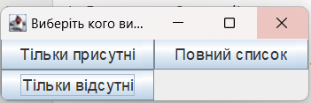

<h1>Inactive</h1>
<h1>Додаток до розширення <a href="https://chrome.google.com/webstore/detail/google-meet-attendance-li/appcnhiefcidclcdjeahgklghghihfok">Google Meet Attendance</a></h1>
<i>Зверніть увагу, що наразі потрібно компілювати власноруч, самостійне налаштування недоступне поки що</i>

<b>Порядок роботи:</b>
<ol>
    <li>[Тільки перший раз] Перейменуйте `src/test_students.txt` на `res/students.txt`. Додайте прізвище + ім'я своїх студентів/учнів у форматі `Іван Петренко` у стовпчик. Примітка. Якщо у студента декілька обліківок, то додайте через кому усі. Наприклад, `Іван Петренко,Ivan Petrenko`.
</li>
    <li>Завантажте csv файл з розширення</li>
    <li>Скомпілюйте програму. Бажано використовувати Java 17.</li>
    <li>Виберіть файл.</li>
    <li>Виберіть, що вам потрібно скопіювати</li>
        
    <li>???</li>
    <li>Усе зроблено. Вставляйте куди вам необхідно.</li>
</ol>
